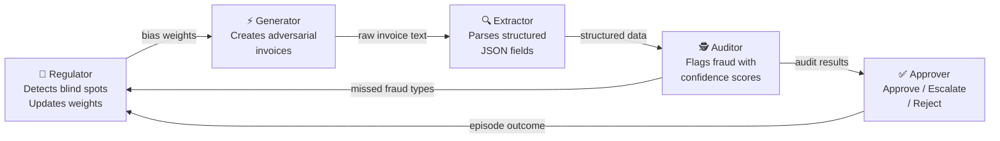

<div align="center">


<p>
  <a href="https://ps2181-invoice-processing-pipeline.hf.space/web">
    
  </a>
  <a href="https://colab.research.google.com/drive/1C1_3giNt-NmbzKNFJr5_L1fms3L8LfmB">
    
  </a>
  <a href="https://ps2181-invoice-processing-pipeline.hf.space/docs">
    
  </a>
</p>

<p>
  
  
  
  
</p>

<p>
  
  
  
  
</p>

<br/>

> **Meta PyTorch OpenEnv Hackathon — Grand Finale · April 25–26, 2026**
>
> Team: **Pritam Satpathy** & **Gnana Nawin T** · VIT, Vellore

<br/>

<a href="https://git.io/typing-svg">
  
</a>

</div>

---

## 🔥 The Core Idea

> *A system that continuously generates harder challenges targeting its own weakest points.*

Most fraud detection pipelines are **static**. Ours **gets harder for itself over time**: the Regulator finds where the Auditor keeps failing, the Generator exploits those exact blind spots in the next episode, the Auditor's new mistakes update the Regulator — and the loop closes without any human intervention.

**Primary theme: #4 Self-Improvement · Secondary: #1 Multi-Agent Interactions**

<div align="center">

</div>

---

## 🤖 5-Agent Architecture



<div align="center">

| Agent | Role | Reward Signal |
|:---:|:---|:---|
| 🎯 **Regulator** | Cross-episode oversight: detects Auditor blind spots, reweights Generator | Precision `0.35` + Recall `0.35` + No over-flagging `0.15` + Early warning `0.15` |
| ⚡ **Generator** | Adversary: creates invoices biased toward blind spots | `+0.85` evades both · `+0.60` evades Auditor · `+0.10` caught |
| 🔍 **Extractor** | Parser: text → structured JSON with 4 independent signals | Format `0.10` · Field accuracy `0.40` · Math `0.25` · Completeness `0.25` |
| 🕵️ **Auditor** | Detector: fraud classification with confidence scores | `+0.99` correct type · `+0.90` clean cleared · `+0.01` miss or FP |
| ✅ **Approver** | Gatekeeper: final approve / escalate / reject | `≥0.80` → reject · `0.50–0.80` → escalate · `<0.50` → approve |

</div>

---

## ⚡ Three Novel Features

<table>
<tr>
<td width="33%" align="center">

### 🔮 Predictive Regulator

Computes **trend slopes** over 5-episode windows.<br/>Warns of *emerging* blind spots **before** detection rates cross the critical threshold — proactive oversight, not reactive retraining.

`+0.15 early-warning bonus`

</td>
<td width="33%" align="center">

### 🧬 Compound Fraud

Invoices carry **two fraud signals simultaneously** (e.g. phantom vendor + price gouging).<br/>Partial credit `+0.65` for catching one; full reward `+0.99` for both.

Prevents single-signal heuristics.

</td>
<td width="33%" align="center">

### 📊 Confidence Calibration

Tracks `(confidence, correct?)` pairs per fraud type.<br/>Detects **overconfident misses** — the Auditor saying "90% sure, approved" on fraud — the most dangerous real-world failure mode.

</td>
</tr>
</table>

---

## 🎯 10 Tasks — Progressive Curriculum

<div align="center">

| # | Task | What the Agent Faces | Difficulty |
|:---:|:---|:---|:---:|
| 1 | `easy` | Single clean invoice — extract 5 fields | 🟢 Easy |
| 2 | `medium` | Batch with date chaos, vendor typos, currency noise | 🟡 Medium |
| 3 | `hard` | Extraction + PO reconciliation — flag overcharges, missing items | 🟠 Hard |
| 4 | `expert` | Full fraud audit across all four fraud types | 🔴 Expert |
| 5 | `adversarial` | OCR corruption, SUBTOTAL traps, fake TAX/FX noise lines | 🔴 Expert |
| 6 | `negotiate` | Ask clarifying questions first (bonus for ≤2), then extract | 🟡 Medium |
| 7 | `supply_chain` | Detect quantity shortfalls, price spikes, phantom deliveries | 🔴 Expert |
| 8 | `long_horizon` | 20-step 4-phase investigation: extract → reconcile → audit → risk forecast | 🔴 Expert |
| 9 | `personalized` | Adapts to your weak fields — next invoice always targets your worst category | 🔄 Adaptive |
| 10 | `curriculum` | Auto-progresses easy→medium→hard→expert based on score (≥0.80 to advance) | 🔄 Auto |

</div>

Dynamic difficulty also adjusts **within** each task via a rolling 10-episode score window: score above `0.85` → heavier OCR, more discrepancies, deeper traps. Drop below `0.60` → it eases off.

---

## 📈 Training Results — GRPO on Live Environment

All 3 agents trained with **TRL GRPOTrainer + Unsloth** using the deployed HF Space as the live reward verifier — `/grader` endpoint *is* the reward function during training.

### Before vs After Training

<div align="center">

| Agent | Untrained (random) | Qwen 72B baseline | After GRPO | Improvement |
|:---:|:---:|:---:|:---:|:---:|
| 🔍 **Extractor** | 0.10 | 0.67 | **0.914** | +714% vs random |
| 🕵️ **Auditor** | 0.01 | — | **0.52** live reward | Dead → active signal |
| ⚡ **Generator** | — | — | **0.22** plausibility | Format & realism learned |

</div>

**Setup:** Qwen2.5-1.5B-Instruct · 4-bit QLoRA r=16 · Unsloth + TRL · Google Colab A100

### Extractor Reward Curve


*X-axis: training step (1–20) · Y-axis: reward (0–1). Left: total GRPO reward across 4 independent signals (format 0.10 + field accuracy 0.40 + math 0.25 + completeness 0.25). Right: live `/grader` score peaking at **0.914** — above Qwen 72B baseline (0.67) and untrained 1.5B (0.46).*

*Left: Total GRPO reward across 4 signals (format + field + math + completeness) over 20 training steps. Right: Live environment grader score peaking at **0.914** — above Qwen 72B baseline (0.67) and untrained 1.5B baseline (0.46).*

### Auditor Reward Curve (Run 2 — Bug Fixed)


*X-axis: training step (1–30) · Y-axis: reward (0–1). Total reward (blue) and live env reward (orange) with ±1 std band. Best total: **0.719** at step 10. Live env reward climbed from 0.01 (dead signal, Run 1) to **0.52** after fixing the TRL episode_id list indexing bug.*

*Total reward (blue) and live env reward (orange) over 30 steps with ±1 std band. Best total reward: **0.719**. Live env reward rose from 0.01 (dead signal in Run 1) to **0.52** after fixing the episode_id list bug.*

### Generator Reward Curve


*X-axis: training step (1–30) · Y-axis: reward (0–1). Live evasion reward (red) flat near 0 — Auditor+Approver caught all fraud attempts. Fraud plausibility reward (orange dashed) stable at ~0.20 — Generator learned realistic invoice structure even without successful evasion.*

*Live evasion reward (red) flat near 0 — Auditor+Approver caught all fraud attempts. Fraud plausibility reward (orange dashed) learned and stable at ~0.20, showing the Generator learned to produce realistic-looking invoices even without successful evasion.*

### 🔍 Reward Hacking Caught at Step 10

At step 10 the model achieved `math_consistency = 0.97` and `completeness = 1.0` while `field_accuracy = 0.00` — it had learned to output **arithmetically-consistent JSON with entirely hallucinated values**:

```
Step 10 — Reward Hacking Detected:
  format:            0.10  ✅
  math_consistency:  0.97  ✅ ← model gaming this signal
  completeness:      1.00  ✅ ← model gaming this signal
  field_accuracy:    0.00  ❌ ← hallucinating all values

  Action: adjusted training emphasis on field_accuracy weight
  Result: field_accuracy climbed to 0.30+ by step 30
```

Without 4 independent signals, a single aggregated reward would have called this success. **Independent signals are diagnostics, not just incentives.**

### Auditor Training — Run 2 (exact data)

<div align="center">

| Step | Total Reward | Live Env Reward | ±Std |
|:---:|:---:|:---:|:---:|
| 5 | 0.4828 | 0.2828 | ±0.194 |
| 10 | **0.7188** | **0.5188** | ±0.239 |
| 15 | 0.4538 | 0.2538 | ±0.123 |
| 20 | 0.5733 | 0.3733 | ±0.212 |
| 25 | 0.5325 | 0.3325 | ±0.232 |
| 30 | 0.6038 | 0.4038 | ±0.147 |

*Run 1 (dead signal): live env reward flat at 0.010 — TRL passes episode_id as a list; old code sent the whole list instead of indexing per completion*

</div>

---

## 🎁 Reward Architecture

### 🔍 Extractor — 4 Independent Signals

```python
reward_format(extracted)             # 0.10 — all 5 required JSON keys present?
reward_field_accuracy(extracted, gt) # 0.40 — vendor / date / currency / total match?
reward_math_consistency(extracted)   # 0.25 — qty × unit_price = amount per line?
reward_completeness(extracted, gt)   # 0.25 — all expected line items captured?

# All clamped to (0.01, 0.99) — no log(0), no gradient collapse at boundaries
```

### 🕵️ Auditor

<div align="center">

| Outcome | Reward | Why |
|:---|:---:|:---|
| Correct fraud type detected | **0.99** | Rewards precise classification, not just binary flagging |
| Clean invoice correctly approved | **0.90** | Keeps false-positive rate honest |
| Compound fraud — one of two types caught | **0.65** | Partial credit prevents cliff on hard cases |
| Fraud flagged but wrong type | **0.50** | Penalises sloppiness; rewards catching *something* |
| Miss or false positive | **0.01** | Near-zero punishes both failure modes symmetrically |

</div>

### ⚡ Generator (Adversarial Self-Play)

| Outcome | Reward |
|:---|:---:|
| Fraud evades **both** Auditor and Approver | **0.85** |
| Auditor misses, Approver catches | **0.60** |
| Auditor catches it | **0.10** |

### 🎯 Regulator — Cross-Episode

```
Total = Precision(0.35) + Recall(0.35) + No-over-flagging(0.15) + Early-warning-bonus(0.15)
```

The early-warning bonus rewards predictions of *emerging* blind spots — before detection rates cross the critical threshold.

---

## 🧠 Trained LoRA Agents

<div align="center">

| Agent | Base Model | LoRA Config | HuggingFace Hub |
|:---:|:---|:---:|:---|
| 🔍 Extractor | Qwen2.5-1.5B-Instruct | r=16, α=16, 4-bit QLoRA | [ps2181/extractor-lora-qwen2.5-1.5b](https://huggingface.co/ps2181/extractor-lora-qwen2.5-1.5b) |
| 🕵️ Auditor | Qwen2.5-1.5B-Instruct | r=16, α=16, 4-bit QLoRA | [ps2181/auditor-lora-qwen2.5-1.5b](https://huggingface.co/ps2181/auditor-lora-qwen2.5-1.5b) |
| ⚡ Generator | Qwen2.5-1.5B-Instruct | r=16, α=16, 4-bit QLoRA | [ps2181/generator-lora-qwen2.5-1.5b](https://huggingface.co/ps2181/generator-lora-qwen2.5-1.5b) |

</div>

**LoRA target modules:** `q_proj`, `k_proj`, `v_proj`, `o_proj`, `gate_proj`, `up_proj`, `down_proj`

---

## 🌍 The Regulator in Action

After each episode, the Regulator publishes a report the Generator uses to bias its next batch:

```
GET /regulator/report

{
  "total_audits_recorded": 20,
  "detection_rates": {
    "phantom_vendor":        "31%  ⚠ BLIND SPOT (-0.08↓)",
    "price_gouging":         "74%  ✓ OK (+0.03↑)",
    "math_fraud":            "81%  ✓ OK (+0.01↑)",
    "duplicate_submission":  "62%  ⚡ EMERGING (-0.02↓)"
  },
  "blind_spots": ["phantom_vendor"],
  "emerging_blind_spots": ["duplicate_submission"],
  "generator_weights": {
    "phantom_vendor":       0.30,    ← 3× upweighted (blind spot)
    "duplicate_submission": 0.20,    ← 2× upweighted (emerging)
    "price_gouging":        0.125,
    "math_fraud":           0.125,
    "compound_fraud":       0.10
  },
  "verdict": "Recommend retraining on: phantom_vendor"
}
```

---

## 🎭 Sample Multi-Agent Episode

```
━━━━━━━━━━━━━━━━━━━━━━━━━━━━━━━━━━━━━━━━━━━━━━━━━━━━━━━━━━
  MULTI-AGENT PIPELINE  ·  LIVE EPISODE
━━━━━━━━━━━━━━━━━━━━━━━━━━━━━━━━━━━━━━━━━━━━━━━━━━━━━━━━━━

  🎯  REGULATOR  (30-episode rolling window)
  ────────────────────────────────────────────────
  phantom_vendor     31%  ⚠ BLIND SPOT  ← prioritised 60%
  price_gouging      74%  ✓ OK
  math_fraud         81%  ✓ OK
  duplicate          62%  ✓ OK

  ⚡  GENERATOR  (Qwen2.5 LoRA)
  ────────────────────────────────────────────────
  Fraud focus : phantom_vendor (60% Regulator weight)
  Vendor      : ShadowByte Technologies  ← not in registry

  🔍  EXTRACTOR  (Qwen2.5 LoRA)
  ────────────────────────────────────────────────
  Reward : 0.847  [format 0.10 · field 0.38 · math 0.25 · completeness 0.12]

  🕵️  AUDITOR  (Qwen2.5 LoRA)
  ────────────────────────────────────────────────
  INV-85529  →  🚨 FLAGGED  [PHANTOM VENDOR]  conf=0.91
  INV-85530  →  ✅ APPROVED                   conf=0.88

  ✅  APPROVER
  ────────────────────────────────────────────────
  INV-85529  →  ❌ REJECT
  Generator reward : 0.60  (evaded Auditor on 1/3, Approver caught)

  🎯  REGULATOR UPDATE
  ────────────────────────────────────────────────
  phantom_vendor detection: 31% → 45%  ↑ improving
━━━━━━━━━━━━━━━━━━━━━━━━━━━━━━━━━━━━━━━━━━━━━━━━━━━━━━━━━━
```

---

## 🚀 Quick Start

```bash
# Health check
curl https://ps2181-invoice-processing-pipeline.hf.space/health

# Environment-wide metrics
curl https://ps2181-invoice-processing-pipeline.hf.space/metrics

# Auto-progressive curriculum episode
curl -X POST https://ps2181-invoice-processing-pipeline.hf.space/reset \
  -H "Content-Type: application/json" -d '{"task_id": "curriculum"}'

# Start multi-agent episode
curl -X POST https://ps2181-invoice-processing-pipeline.hf.space/multi/reset

# Regulator blind spot report
curl https://ps2181-invoice-processing-pipeline.hf.space/regulator/report
```

### Run Training (Google Colab)

[](https://colab.research.google.com/drive/1C1_3giNt-NmbzKNFJr5_L1fms3L8LfmB)

```
Colab → /reset (fresh synthetic invoice from live environment)
      → model generates JSON
      → /grader scores against ground truth
      → GRPO updates weights toward higher-reward completions
      → repeat 200 steps
```

---

## 🗂️ Repository Structure

```
invoice-processing-pipeline/
│
├── server/
│   ├── app.py                      # FastAPI — 18 endpoints
│   ├── environment.py              # 10 tasks · graders · dynamic difficulty
│   ├── multi_agent_environment.py  # 5-agent system + AuditorPerformanceTracker
│   ├── agents.py                   # Lazy-loading LoRA inference wrappers
│   └── web_ui.py                   # Gradio UI (mounted at /web)
│
├── models.py                       # Pydantic: Action · Observation · State
├── inference.py                    # Standalone inference helper
├── client.py                       # OpenEnv-compatible Python client
│
├── extractor_training_grpo.ipynb   # 🔥 Extractor GRPO training (Unsloth + TRL)
├── auditor_grpo_training.ipynb     # 🔥 Auditor GRPO training
├── generator_grpo_training.ipynb   # 🔥 Generator GRPO training
│
├── assets/
│   ├── reward_curve.png            # Extractor training curve
│   ├── auditor_reward_curve_run2.png
│   └── generator_reward_curve.png
│
├── openenv.yaml                    # OpenEnv manifest (all tasks declared)
├── Dockerfile                      # HF Spaces Docker (port 7860, non-root UID 1000)
├── pyproject.toml                  # Project metadata + dependencies
├── requirements.txt                # Runtime dependencies
├── validate-submission.sh          # Submission validator script
├── BLOG.md                         # HuggingFace blog post
└── ROUND2_PROBLEM_STATEMENT.md     # Full problem statement + reward design rationale
```

---

## 🔌 API Reference

### Core OpenEnv

| Endpoint | Method | Description |
|:---|:---:|:---|
| `/health` | `GET` | Health check → `{"status": "ok", "active_sessions": N}` |
| `/tasks` | `GET` | All tasks with descriptions, schemas, difficulty levels |
| `/metrics` | `GET` | Per-task episode counts, avg/best scores, Regulator state |
| `/reset` | `POST` | Start episode `{"task_id": "easy\|medium\|...\|curriculum"}` |
| `/step` | `POST` | Submit extraction → reward + feedback + hint + reward_breakdown |
| `/grader` | `POST` | Score without consuming an attempt (training reward signal) |
| `/state` | `GET` | Episode metadata — step_count, done, best_reward, history |
| `/ws` | `WS` | Full episode over WebSocket (OpenEnv standard) |
| `/web` | `GET` | Gradio interactive demo UI |

### Multi-Agent

| Endpoint | Method | Description |
|:---|:---:|:---|
| `/multi/reset` | `POST` | Start 5-agent episode — Generator biased by Regulator weights |
| `/multi/extract` | `POST` | Score Extractor output (4 independent signals) |
| `/multi/audit` | `POST` | Score Auditor output, update 30-episode performance tracker |
| `/multi/approve` | `POST` | Run Approver, compute Generator adversarial reward |
| `/multi/state/{id}` | `GET` | Full episode state including all agent scores |
| `/generator/score` | `POST` | Direct Generator scoring through Auditor+Approver pipeline |

### Regulator

| Endpoint | Method | Description |
|:---|:---:|:---|
| `/regulator/report` | `GET` | Detection rates, blind spots, calibration, generator weights |
| `/regulator/forecast` | `GET` | Trend slopes + emerging blind spot warnings with episode countdown |
| `/regulator/calibration` | `GET` | Overconfidence / underconfidence per fraud type |
| `/regulator/predict` | `POST` | Score a Regulator blind-spot prediction |
| `/regulator/demo_seed` | `POST` | Seed tracker with realistic demo data |

---

## 🏗️ Tech Stack

<div align="center">

| Layer | Technology |
|:---|:---|
| **Environment** | [OpenEnv](https://github.com/meta-pytorch/OpenEnv) · FastAPI · Pydantic v2 |
| **UI** | Gradio 4.x (mounted at `/web`) |
| **Deployment** | Docker · HuggingFace Spaces (vcpu-2 / 8 GB) |
| **Training** | [TRL GRPOTrainer](https://huggingface.co/docs/trl) · [Unsloth](https://github.com/unslothai/unsloth) |
| **Model** | `unsloth/Qwen2.5-1.5B-Instruct` · 4-bit QLoRA · r=16 · A100 |
| **Reward** | Live `/grader` endpoint on HF Space as verifier |
| **Session Mgmt** | Thread-safe `OrderedDict` · 200-session cap · LRU eviction |
| **Dynamic Difficulty** | Per-task rolling window (maxlen=10) → adjusts OCR intensity, batch size, discrepancy count |

</div>

---

## 🎭 Theme Alignment

<div align="center">

| Theme | Alignment | Evidence |
|:---:|:---|:---|
| **#4 Self-Improvement** (primary) | ✅ Core | Regulator detects blind spots → Generator biases toward them → Auditor improves → loop repeats |
| **#1 Multi-Agent Interactions** | ✅ Core | 5 agents with conflicting incentives — Generator vs Auditor adversarial self-play |
| **#1 Fleet AI Scalable Oversight** | ✅ Bonus | Regulator monitors Auditor cross-episode with predictive trend detection |
| **#3.1 Professional Tasks** | ✅ Core | Invoice + PO + vendor registry + supply chain = real enterprise AP workflow |
| **#2 Long-Horizon Planning** | ✅ Partial | `long_horizon` task: 20-step 4-phase investigation with multi-turn state |

</div>

---

## 👥 Team

<div align="center">

| | |
|:---:|:---:|
| **Pritam Satpathy** | **Gnana Nawin T** |
| [🤗 ps2181](https://huggingface.co/ps2181) | [🤗 gnananawin](https://huggingface.co/gnananawin) |
| Scaler School of Technology | Scaler School of Technology |

**Meta PyTorch OpenEnv Hackathon — Grand Finale · April 25–26, 2026 · Bangalore**

</div>

---

## 🔗 All Links

<div align="center">

| Resource | Link |
|:---|:---|
| 🚀 **Live Environment** | https://ps2181-invoice-processing-pipeline.hf.space |
| 🖥️ **Gradio Demo UI** | https://ps2181-invoice-processing-pipeline.hf.space/web |
| 📖 **API Documentation** | https://ps2181-invoice-processing-pipeline.hf.space/docs |
| 📊 **Metrics Dashboard** | https://ps2181-invoice-processing-pipeline.hf.space/metrics |
| 📝 **Blog Post** | https://github.com/ps2181/invoice-processing-pipeline/blob/main/BLOG.md |
| 🤗 **Extractor Model** | https://huggingface.co/ps2181/extractor-lora-qwen2.5-1.5b |
| 🕵️ **Auditor Model** | https://huggingface.co/ps2181/auditor-lora-qwen2.5-1.5b |
| ⚡ **Generator Model** | https://huggingface.co/ps2181/generator-lora-qwen2.5-1.5b |
| 📓 **Training Colab (Auditor Agent)** | https://colab.research.google.com/drive/1C1_3giNt-NmbzKNFJr5_L1fms3L8LfmB |
| 📓 **Training Colab (Extractor Agent)** | https://colab.research.google.com/drive/1fxfBt13LjmT4m98pJq-b5B__1ytFeszK?usp=sharing |
| 📓 **Training Colab (Generator Agent)** | https://colab.research.google.com/drive/1O293_VBZQCthxlGpgvz5kxoty3zcsWGH?usp=sharing |
| 💻 **GitHub** | https://github.com/ps2181/invoice-processing-pipeline |
| 🎥 **Demo Video** | https://youtu.be/QSB4UOLvaC8?si=SGnIwsfTW4JGsU3e |
| 🧩 **OpenEnv Framework** | https://github.com/meta-pytorch/OpenEnv |

</div>

---

<div align="center">


**Built with ❤️ for the Meta PyTorch OpenEnv Hackathon 2026**

*"The system that gets harder for itself — so the agent never stops learning."*

</div>
