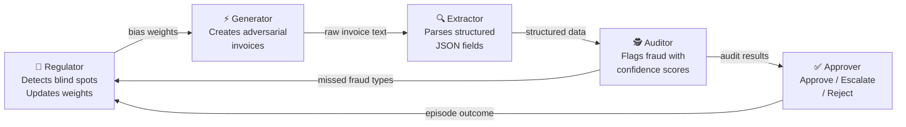

# 🧾 Invoice Processing Pipeline — Self-Improving Adversarial Fraud Detection

> **Meta PyTorch OpenEnv Hackathon** · Team: Pritam Satpathy & Gnana Nawin T
>
> **Primary theme: #4 Self-Improvement** · **Secondary: #1 Multi-Agent Interactions**

**Live Demo** → [ps2181-invoice-processing-pipeline.hf.space/web](https://ps2181-invoice-processing-pipeline.hf.space/web)  
**API Docs** → [ps2181-invoice-processing-pipeline.hf.space/docs](https://ps2181-invoice-processing-pipeline.hf.space/docs)

---

## The Core Idea

> *A system that continuously generates harder challenges targeting its own weakest points.*

Most fraud detection pipelines are static. Ours **gets harder for itself over time**: the Regulator finds where the Auditor keeps failing, the Generator exploits those exact blind spots in the next episode, the Auditor's new mistakes update the Regulator — and the loop closes.

---

## 5-Agent Architecture



Each agent has **independent reward signals** — no shared objective, genuine multi-agent dynamics:

| Agent | Role | Reward signal |
|-------|------|---------------|
| **Regulator** | Oversight: detects Auditor blind spots, reweights Generator | Precision + Recall + Early-warning bonus |
| **Generator** | Adversary: creates invoices biased toward blind spots | Evasion rate (0.85 evades both, 0.10 if caught) |
| **Extractor** | Parser: structured JSON extraction with 4 signals | Format + Field accuracy + Math + Completeness |
| **Auditor** | Detector: fraud classification with confidence | 0.99 correct type, 0.90 clean, 0.01 miss |
| **Approver** | Gatekeeper: final approve/escalate/reject | Rule-based (confidence threshold) |

---

## Three Novel Features

| Feature | What it does |
|---------|-------------|
| **Predictive Regulator** | Computes trend slope over 5-episode windows — warns of *emerging* blind spots before they become critical, not just current ones |
| **Compound Fraud** | Invoices can carry two simultaneous fraud signals (e.g. phantom vendor + price gouging). Partial credit for catching one; full reward for both |
| **Confidence Calibration** | Tracks (confidence, correct?) pairs per fraud type. Flags *overconfident misses* — Auditor saying "90% sure, approved" on a fraudulent invoice — the most dangerous failure mode |

---

## Training Results — GRPO on Live Environment

All 3 agents trained with **TRL GRPOTrainer + Unsloth** using the deployed HF Space as the live reward verifier:

| Agent | Baseline | Best Achieved | Notes |
|-------|----------|--------------|-------|
| **Extractor** | 0.10 (random) | **0.914** live grader score | Peaked step 15; crashed due to `_MAX_SESSIONS=50` bug (fixed to 200) |
| **Auditor** | 0.01 (dead signal) | **0.719** total reward | Run 1 had dead live reward (episode_id list bug); Run 2 fixed → 0.01→0.52 |
| **Generator** | — | Format learned (~0.22) | Live evasion reward had same bug; format/plausibility reward improved |

**Training setup:** Qwen2.5-1.5B-Instruct, 4-bit QLoRA r=16, Unsloth + TRL, Google Colab A100

### Auditor Training Log (Run 2 — exact data)

| Step | Total Reward | Live Env Reward | ±Std |
|------|-------------|----------------|------|
| 5  | 0.4828 | 0.2828 | ±0.194 |
| 10 | **0.7188** | **0.5188** | ±0.239 |
| 15 | 0.4538 | 0.2538 | ±0.123 |
| 20 | 0.5733 | 0.3733 | ±0.212 |
| 25 | 0.5325 | 0.3325 | ±0.232 |
| 30 | 0.6038 | 0.4038 | ±0.147 |

*Run 1 (dead signal): live env reward = 0.010 flat across all steps (episode_id list bug — TRL passes episode_id as a list, old code sent the whole list to the server instead of indexing per completion)*

---

## Trained LoRA Agents

| Agent | HF Hub |
|-------|--------|
| Extractor | [ps2181/extractor-lora-qwen2.5-1.5b](https://huggingface.co/ps2181/extractor-lora-qwen2.5-1.5b) |
| Auditor   | [ps2181/auditor-lora-qwen2.5-1.5b](https://huggingface.co/ps2181/auditor-lora-qwen2.5-1.5b) |
| Generator | [ps2181/generator-lora-qwen2.5-1.5b](https://huggingface.co/ps2181/generator-lora-qwen2.5-1.5b) |

---

## Sample Episode Trace

```
━━━━━━━━━━━━━━━━━━━━━━━━━━━━━━━━━━━━━━━━━━━━━━━━━━━━━━━━━━
  MULTI-AGENT PIPELINE  ·  LIVE EPISODE
━━━━━━━━━━━━━━━━━━━━━━━━━━━━━━━━━━━━━━━━━━━━━━━━━━━━━━━━━━

  🎯  STEP 0 — REGULATOR
  ────────────────────────────────────────────────
  Blind spots detected : phantom_vendor
  Fraud weights → next episode:
    phantom_vendor             60%  ▓▓▓▓▓▓▓▓▓▓▓▓▓▓  ← prioritised
    price_gouging              20%  ▓▓▓▓▓
    math_fraud                 10%  ▓▓
    duplicate_submission       10%  ▓▓

  ⚡  STEP 1 — GENERATOR  (Qwen2.5 LoRA)
  ────────────────────────────────────────────────
  Episode  : ep_8f3a2c…
  Invoices : 3
  Fraud focus : Phantom Vendor (60% Regulator weight)

  🔍  STEP 2 — EXTRACTOR  (Qwen2.5 LoRA)
  ────────────────────────────────────────────────
  Vendor   : ShadowByte Technologies          ← not in registry
  Total    : $12,450.00
  Reward   : 0.847  [format 0.10  field 0.38  math 0.25  completeness 0.12]

  🕵️  STEP 3 — AUDITOR  (Qwen2.5 LoRA)
  ────────────────────────────────────────────────
  INV-85529  →  🚨 FLAGGED  [PHANTOM VENDOR]  conf=0.91
  INV-85530  →  ✅ APPROVED                   conf=0.88
  Mean reward : 0.623

  ✅  STEP 4 — APPROVER
  ────────────────────────────────────────────────
  INV-85529  →  ❌ REJECT
  INV-85530  →  ✅ APPROVE

  Generator adversarial reward : 0.60   (evaded Auditor on 1/3, Approver caught)

  🎯  STEP 5 — REGULATOR UPDATE
  ────────────────────────────────────────────────
  phantom_vendor detection improved: 31% → 45%
  Generator weights updated for next episode
━━━━━━━━━━━━━━━━━━━━━━━━━━━━━━━━━━━━━━━━━━━━━━━━━━━━━━━━━━
```

---

## Reward Signals

### Extractor (4 independent signals)
| Signal | Max | What it measures |
|--------|-----|-----------------|
| Format | 0.10 | Required fields present |
| Field accuracy | 0.40 | Vendor / date / currency / total correct |
| Math consistency | 0.25 | qty × unit_price = amount, sum = total |
| Completeness | 0.25 | All line items captured |

### Auditor
| Outcome | Reward |
|---------|--------|
| Correct fraud type detected | 0.99 |
| Clean invoice correctly approved | 0.90 |
| Compound fraud — one type caught | 0.65 |
| Fraud detected, wrong type | 0.50 |
| Miss or false positive | 0.01 |

### Generator (adversarial)
| Outcome | Reward |
|---------|--------|
| Evades both Auditor and Approver | 0.85 |
| Evades Auditor, Approver catches | 0.60 |
| Auditor catches it | 0.10 |

### Regulator
Precision (0.35) + Recall (0.35) + No over-flagging (0.15) + Early warning bonus (0.15)

---

## API Endpoints

### Core OpenEnv
| Endpoint | Method | Description |
|----------|--------|-------------|
| `/reset` | POST | Start episode (`{"task_id": "easy\|medium\|hard\|expert\|adversarial\|negotiate\|supply_chain"}`) |
| `/step`  | POST | Submit extracted data, get reward + feedback |
| `/grader`| POST | Score without modifying state |
| `/state` | GET  | Episode metadata |
| `/health`| GET  | Health check |
| `/ws`    | WS   | WebSocket interface |

### Multi-Agent
| Endpoint | Method | Description |
|----------|--------|-------------|
| `/multi/reset`   | POST | Start 5-agent episode, Generator biased by Regulator |
| `/multi/extract` | POST | Score Extractor output (4 signals) |
| `/multi/audit`   | POST | Score Auditor output, update tracker |
| `/multi/approve` | POST | Run Approver, compute Generator reward |

### Regulator
| Endpoint | Method | Description |
|----------|--------|-------------|
| `/regulator/report`      | GET  | Detection rates, blind spots, weights |
| `/regulator/forecast`    | GET  | Predictive trend analysis |
| `/regulator/calibration` | GET  | Confidence calibration per fraud type |
| `/regulator/predict`     | POST | Score Regulator blind spot predictions |

---

## Quick Start

```bash
# Health check
curl https://ps2181-invoice-processing-pipeline.hf.space/health

# Start a multi-agent episode
curl -X POST https://ps2181-invoice-processing-pipeline.hf.space/multi/reset

# Get Regulator blind spot report
curl https://ps2181-invoice-processing-pipeline.hf.space/regulator/report

# Predictive forecast
curl https://ps2181-invoice-processing-pipeline.hf.space/regulator/forecast
```

---

## Fraud Types

| Type | Description |
|------|-------------|
| `phantom_vendor` | Vendor not in the Approved Vendor Registry |
| `price_gouging` | Unit price > 150% of market max |
| `math_fraud` | Invoice total ≠ sum of line items |
| `duplicate_submission` | Same invoice_id or vendor+date+total already seen |
| `compound_fraud` | Two fraud signals in one invoice |

---

## Links

- **Live Demo**: [ps2181-invoice-processing-pipeline.hf.space/web](https://ps2181-invoice-processing-pipeline.hf.space/web)
- **API Docs**: [ps2181-invoice-processing-pipeline.hf.space/docs](https://ps2181-invoice-processing-pipeline.hf.space/docs)
- **GitHub**: [github.com/ps2181/invoice-processing-pipeline](https://github.com/ps2181/invoice-processing-pipeline)
- **OpenEnv**: [github.com/meta-pytorch/OpenEnv](https://github.com/meta-pytorch/OpenEnv)
- **Extractor LoRA**: [ps2181/extractor-lora-qwen2.5-1.5b](https://huggingface.co/ps2181/extractor-lora-qwen2.5-1.5b)
- **Auditor LoRA**: [ps2181/auditor-lora-qwen2.5-1.5b](https://huggingface.co/ps2181/auditor-lora-qwen2.5-1.5b)
- **Generator LoRA**: [ps2181/generator-lora-qwen2.5-1.5b](https://huggingface.co/ps2181/generator-lora-qwen2.5-1.5b)
