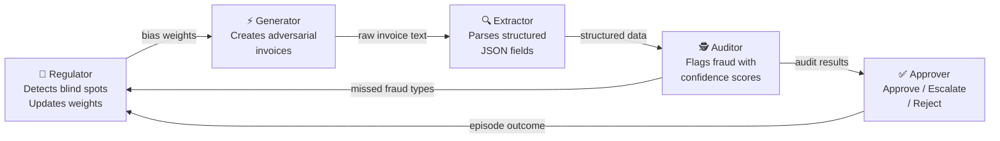

<div align="center">

# 🧾 Invoice Processing Pipeline
### Self-Improving Adversarial Fraud Detection Environment

**Meta PyTorch OpenEnv Hackathon · Grand Finale · April 25–26, 2026**  
*Pritam Satpathy & Gnana Nawin T · Scaler School of Technology, Bangalore*

<br/>

[](https://ps2181-invoice-processing-pipeline.hf.space/web)
[](https://ps2181-invoice-processing-pipeline.hf.space/docs)
[](https://github.com/ps2181/invoice-processing-pipeline)

> **Primary theme: #4 Self-Improvement · Secondary: #1 Multi-Agent Interactions**

</div>

---

## The Core Idea

> *A system that continuously generates harder challenges targeting its own weakest points.*

Most fraud detection pipelines are static. Ours **gets harder for itself over time**: the Regulator finds where the Auditor keeps failing, the Generator exploits those exact blind spots in the next episode, the Auditor's new mistakes update the Regulator — and the loop closes without any human intervention.

<div align="center">

</div>

---

## 5-Agent Architecture



<div align="center">

| Agent | Role | Reward Signal |
|:---:|:---|:---|
| **🎯 Regulator** | Cross-episode oversight: detects Auditor blind spots, reweights Generator | Precision `0.35` + Recall `0.35` + No over-flagging `0.15` + Early warning `0.15` |
| **⚡ Generator** | Adversary: creates invoices biased toward blind spots | `+0.85` evades both · `+0.60` evades Auditor · `+0.10` caught |
| **🔍 Extractor** | Parser: text → structured JSON with 4 independent signals | Format `0.10` · Field accuracy `0.40` · Math `0.25` · Completeness `0.25` |
| **🕵️ Auditor** | Detector: fraud classification with confidence scores | `+0.99` correct type · `+0.90` clean cleared · `+0.01` miss or FP |
| **✅ Approver** | Gatekeeper: final approve / escalate / reject | Rule-based on confidence threshold |

</div>

---

## Three Novel Features

<div align="center">

| Feature | What it does |
|:---|:---|
| **🔮 Predictive Regulator** | Computes trend slopes over 5-episode windows — warns of *emerging* blind spots before they go critical |
| **🧬 Compound Fraud** | Invoices can carry two simultaneous fraud signals (e.g. phantom vendor + price gouging). Partial credit for catching one; full reward for both |
| **📊 Confidence Calibration** | Tracks (confidence, correct?) pairs per fraud type. Flags *overconfident misses* — the most dangerous Auditor failure mode |

</div>

---

## 10 Tasks — Progressive Curriculum

<div align="center">

| # | Task | What the Agent Faces | Difficulty |
|:---:|:---|:---|:---:|
| 1 | `easy` | Single clean invoice — extract 5 fields | Easy |
| 2 | `medium` | Batch with date chaos, vendor typos, currency noise | Medium |
| 3 | `hard` | Extraction + PO reconciliation — flag overcharges, missing items | Hard |
| 4 | `expert` | Full fraud audit across all four fraud types | Expert |
| 5 | `adversarial` | OCR corruption, SUBTOTAL traps, fake TAX/FX noise lines | Expert |
| 6 | `negotiate` | Ask clarifying questions first (bonus for ≤2), then extract | Medium |
| 7 | `supply_chain` | Detect quantity shortfalls, price spikes, phantom deliveries | Expert |
| 8 | `long_horizon` | 20-step 4-phase investigation: extract → reconcile → audit → risk forecast | Expert |
| 9 | `personalized` | Adapts to your weak fields — next invoice always targets your worst category | Adaptive |
| 10 | `curriculum` | Auto-progresses easy→medium→hard→expert based on score (≥0.80 to advance) | Auto |

</div>

Dynamic difficulty also adjusts **within** each task via a rolling 10-episode score window: score above `0.85` → heavier OCR, more discrepancies, deeper traps. Drop below `0.60` → it eases off.

---

## Reward Architecture

### 🔍 Extractor — 4 Independent Signals

```python
reward_format(extracted)             # 0.10 — all 5 required JSON keys present?
reward_field_accuracy(extracted, gt) # 0.40 — vendor / date / currency / total match?
reward_math_consistency(extracted)   # 0.25 — qty × unit_price = amount per line?
reward_completeness(extracted, gt)   # 0.25 — all expected line items captured?

# All clamped to (0.01, 0.99) — no log(0), no gradient collapse at boundaries
```

### 🕵️ Auditor

<div align="center">

| Outcome | Reward | Why |
|:---|:---:|:---|
| Correct fraud type detected | **0.99** | Rewards precise classification, not just flagging |
| Clean invoice correctly approved | **0.90** | Keeps false-positive rate honest |
| Compound fraud — one of two types caught | **0.65** | Partial credit on hard cases |
| Fraud flagged but wrong type | **0.50** | Penalises sloppiness while crediting intent |
| Miss or false positive | **0.01** | Near-zero punishes both failure modes symmetrically |

</div>

### 🎯 Regulator — Cross-Episode

```
Total = Precision(0.35) + Recall(0.35) + No-over-flagging(0.15) + Early-warning-bonus(0.15)
```

The early-warning bonus rewards predictions of *emerging* blind spots — before detection rates cross the critical threshold.

---

## Training Results — GRPO on Live Environment

All 3 agents trained with **TRL GRPOTrainer + Unsloth** using the deployed HF Space as the live reward verifier:

<div align="center">

| Agent | Baseline | Best Achieved | Notes |
|:---:|:---:|:---:|:---|
| **🔍 Extractor** | 0.10 (random) | **0.914** live grader | Peaked step 15 — above Qwen 72B baseline (0.67) |
| **🕵️ Auditor** | 0.01 (dead signal) | **0.719** total reward | Run 1 had episode_id bug; Run 2 → 0.01→0.52 live reward |
| **⚡ Generator** | — | Format learned (~0.22) | Plausibility reward improved; evasion had same bug as Run 1 |

</div>


**Setup:** Qwen2.5-1.5B-Instruct · 4-bit QLoRA r=16 · Unsloth + TRL · Google Colab A100

### The Reward Hacking We Caught at Step 10

At step 10 the model had figured out it could score high by producing *arithmetically consistent* JSON while **hallucinating every actual value**:

```
math_consistency:  0.97   ✓
completeness:      1.00   ✓
field_accuracy:    0.00   ✗  ← vendor, date, total all fabricated
```

Without 4 independent signals, a single aggregated reward would have called this success. The independent signals made the failure immediately visible — and diagnosable.

### Auditor Training Log — Run 2 (exact data)

<div align="center">

| Step | Total Reward | Live Env Reward | ±Std |
|:---:|:---:|:---:|:---:|
| 5 | 0.4828 | 0.2828 | ±0.194 |
| 10 | **0.7188** | **0.5188** | ±0.239 |
| 15 | 0.4538 | 0.2538 | ±0.123 |
| 20 | 0.5733 | 0.3733 | ±0.212 |
| 25 | 0.5325 | 0.3325 | ±0.232 |
| 30 | 0.6038 | 0.4038 | ±0.147 |

*Run 1 (dead signal): live env reward flat at 0.010 — TRL passes episode_id as a list; old code sent the whole list instead of indexing per completion*

</div>

---

## Trained LoRA Agents

<div align="center">

| Agent | HF Hub |
|:---:|:---|
| 🔍 Extractor | [ps2181/extractor-lora-qwen2.5-1.5b](https://huggingface.co/ps2181/extractor-lora-qwen2.5-1.5b) |
| 🕵️ Auditor | [ps2181/auditor-lora-qwen2.5-1.5b](https://huggingface.co/ps2181/auditor-lora-qwen2.5-1.5b) |
| ⚡ Generator | [ps2181/generator-lora-qwen2.5-1.5b](https://huggingface.co/ps2181/generator-lora-qwen2.5-1.5b) |

</div>

---

## Sample Multi-Agent Episode

```
━━━━━━━━━━━━━━━━━━━━━━━━━━━━━━━━━━━━━━━━━━━━━━━━━━━━━━━━━━
  MULTI-AGENT PIPELINE  ·  LIVE EPISODE
━━━━━━━━━━━━━━━━━━━━━━━━━━━━━━━━━━━━━━━━━━━━━━━━━━━━━━━━━━

  🎯  REGULATOR  (30-episode rolling window)
  ────────────────────────────────────────────────
  phantom_vendor     31%  ⚠ BLIND SPOT  ← prioritised 60%
  price_gouging      74%  ✓ OK
  math_fraud         81%  ✓ OK
  duplicate          62%  ✓ OK

  ⚡  GENERATOR  (Qwen2.5 LoRA)
  ────────────────────────────────────────────────
  Fraud focus : phantom_vendor (60% Regulator weight)
  Vendor      : ShadowByte Technologies  ← not in registry

  🔍  EXTRACTOR  (Qwen2.5 LoRA)
  ────────────────────────────────────────────────
  Reward : 0.847  [format 0.10 · field 0.38 · math 0.25 · completeness 0.12]

  🕵️  AUDITOR  (Qwen2.5 LoRA)
  ────────────────────────────────────────────────
  INV-85529  →  🚨 FLAGGED  [PHANTOM VENDOR]  conf=0.91
  INV-85530  →  ✅ APPROVED                   conf=0.88

  ✅  APPROVER
  ────────────────────────────────────────────────
  INV-85529  →  ❌ REJECT
  Generator reward : 0.60  (evaded Auditor on 1/3, Approver caught)

  🎯  REGULATOR UPDATE
  ────────────────────────────────────────────────
  phantom_vendor detection: 31% → 45%  ↑ improving
━━━━━━━━━━━━━━━━━━━━━━━━━━━━━━━━━━━━━━━━━━━━━━━━━━━━━━━━━━
```

---

## API Reference

### Core OpenEnv

| Endpoint | Method | Description |
|:---|:---:|:---|
| `/reset` | POST | Start episode (`{"task_id": "easy\|medium\|hard\|...\|curriculum"}`) |
| `/step` | POST | Submit extracted data, get reward + feedback |
| `/grader` | POST | Score without modifying state (training reward signal) |
| `/state` | GET | Episode metadata |
| `/health` | GET | Health check + active session count |
| `/metrics` | GET | Per-task episode counts, avg/best scores, Regulator state |
| `/tasks` | GET | Full task list with schemas |
| `/ws` | WS | WebSocket interface |

### Multi-Agent

| Endpoint | Method | Description |
|:---|:---:|:---|
| `/multi/reset` | POST | Start 5-agent episode, Generator biased by Regulator |
| `/multi/extract` | POST | Score Extractor output (4 signals) |
| `/multi/audit` | POST | Score Auditor output, update tracker |
| `/multi/approve` | POST | Run Approver, compute Generator adversarial reward |
| `/generator/score` | POST | Direct Generator scoring through Auditor+Approver pipeline |

### Regulator

| Endpoint | Method | Description |
|:---|:---:|:---|
| `/regulator/report` | GET | Detection rates, blind spots, generator weights |
| `/regulator/forecast` | GET | Trend slopes + emerging blind spot warnings |
| `/regulator/calibration` | GET | Confidence calibration per fraud type |
| `/regulator/predict` | POST | Score Regulator blind spot predictions |

---

## Quick Start

```bash
# Health check
curl https://ps2181-invoice-processing-pipeline.hf.space/health

# Environment-wide metrics
curl https://ps2181-invoice-processing-pipeline.hf.space/metrics

# Auto-progressive curriculum episode
curl -X POST https://ps2181-invoice-processing-pipeline.hf.space/reset \
  -H "Content-Type: application/json" -d '{"task_id": "curriculum"}'

# Start multi-agent episode
curl -X POST https://ps2181-invoice-processing-pipeline.hf.space/multi/reset

# Regulator blind spot report
curl https://ps2181-invoice-processing-pipeline.hf.space/regulator/report
```

---

## Theme Alignment

<div align="center">

| Theme | Alignment |
|:---|:---|
| **#4 Self-Improvement** (primary) | Regulator detects blind spots → Generator biases toward them → Auditor improves → loop repeats |
| **#1 Multi-Agent Interactions** | 5 agents with conflicting incentives (Generator vs Auditor adversarial self-play) |
| **#1 Fleet AI Scalable Oversight** (bonus) | Regulator monitors Auditor cross-episode with predictive trend detection |
| **#3.1 Professional Tasks** | Invoice fraud detection = core enterprise financial workflow |

</div>

---

<div align="center">

*Built for the Meta PyTorch OpenEnv Hackathon 2026.*

**Pritam Satpathy & Gnana Nawin T · Scaler School of Technology · Bangalore**

</div>
